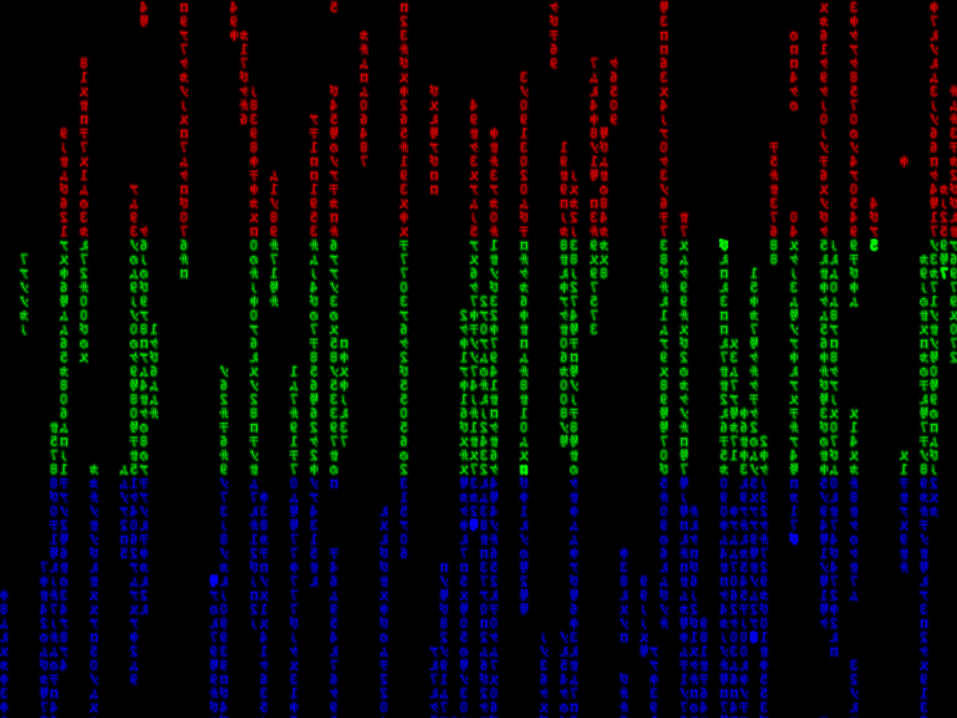

# xscreensaver-xmatrix-color-bands

Adds a `--color-shift` option to xmatrix that takes a string of six-digit comma-separated hex color codes. Up to ten colors can be provided, and colors will be applied as equal-sized horizontal bands.



## Quick testing:
```
./configure
make
./hacks/xmatrix --no-trace --no-knock-knock --small --density 30 --color-shift "ff0000,00ff00,0000ff"
```

